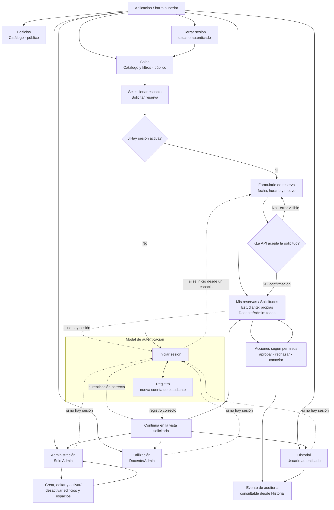

# Mapa de navegación

El diagrama refleja las vistas y reglas de acceso implementadas en el frontend. Las pantallas de autenticación se muestran como modales, no como rutas independientes.

```mermaid
flowchart TD
    APP["Aplicación / barra superior"]
    APP --> SALAS["Salas<br/>Catálogo y filtros · público"]
    APP --> EDIFICIOS["Edificios<br/>Catálogo · público"]
    APP --> RESERVAS["Mis reservas / Solicitudes<br/>Estudiante: propias<br/>Docente/Admin: todas"]
    APP --> HISTORIAL["Historial<br/>Usuario autenticado"]
    APP --> DASHBOARD["Utilización<br/>Docente/Admin"]
    APP --> ADMIN["Administración<br/>Solo Admin"]

    RESERVAS -. "si no hay sesión" .-> AUTH
    HISTORIAL -. "si no hay sesión" .-> AUTH
    DASHBOARD -. "si no hay sesión" .-> AUTH
    ADMIN -. "si no hay sesión" .-> AUTH

    subgraph AUTENTICACION["Modal de autenticación"]
        AUTH["Iniciar sesión"]
        AUTH <--> REGISTRO["Registro<br/>nueva cuenta de estudiante"]
    end
    AUTH -. "autenticación correcta" .-> DESTINO["Continúa en la vista solicitada"]
    REGISTRO -. "registro correcto" .-> DESTINO
    DESTINO --> RESERVAS
    DESTINO --> HISTORIAL
    DESTINO --> DASHBOARD
    DESTINO --> ADMIN

    SALAS --> SELECCION["Seleccionar espacio<br/>Solicitar reserva"]
    SELECCION --> SESION{"¿Hay sesión activa?"}
    SESION -- Sí --> FORMULARIO["Formulario de reserva<br/>fecha, horario y motivo"]
    SESION -- No --> AUTH
    AUTH -. "si se inició desde un espacio" .-> FORMULARIO
    FORMULARIO --> API{"¿La API acepta la solicitud?"}
    API -- "Sí · confirmación" --> RESERVAS
    API -- "No · error visible" --> FORMULARIO

    RESERVAS --> GESTION["Acciones según permisos<br/>aprobar · rechazar · cancelar"]
    GESTION --> RESERVAS
    GESTION --> EVENTO["Evento de auditoría<br/>consultable desde Historial"]
    HISTORIAL --> EVENTO
    ADMIN --> CRUD["Crear, editar y activar/<br/>desactivar edificios y espacios"]
    CRUD --> ADMIN

    APP --> CERRAR["Cerrar sesión<br/>usuario autenticado"]
    CERRAR --> SALAS
```
